 

  

&nbsp;

&nbsp;

---

## About

I'm a software engineer focused on **AI systems, backend infrastructure, and developer platforms**.

Currently, I'm the **Co-Founder & AI Product Engineer at KeiroLabs**, where I work on search, retrieval, browser infrastructure, AI agent workflows, APIs, and platform systems.

My interests sit at the intersection of **AI, distributed systems, backend engineering, and product development**.

---

## Current Work

<table>
<tr>
<td width="50%" valign="top">

### Search & Retrieval

Building systems for:

* Multi-engine search
* Semantic retrieval
* Vector search
* Embeddings
* Web crawling
* Content extraction
* RAG pipelines

</td>

<td width="50%" valign="top">

### AI Infrastructure

Building systems for:

* AI agents
* Browser automation
* Agent workflows
* MCP integrations
* Developer APIs
* SDKs
* Cloud infrastructure

</td>
</tr>
</table>

---

## Selected Projects

### KeiroLabs

**AI infrastructure platform for search, retrieval, browsing, extraction, and AI agents.**

As Co-Founder & AI Product Engineer, I work across the platform — including API architecture, search systems, retrieval pipelines, browser infrastructure, agentic research, and developer tooling.

**Systems**

`Search` `Retrieval` `RAG` `Browser Infrastructure` `AI Agents` `MCP` `APIs`

**Scale**

* 330+ users
* 30–50 paying customers
* 5,000–6,000 requests/day

[KeiroLabs](https://keirolabs.cloud)

---

### Fluras

**Multi-tenant customer operations platform for CRM, subscriptions, and customer management.**

**Focus**

`SaaS` `Backend` `RBAC` `Authentication` `Subscriptions` `APIs`

[Fluras](https://fluras.com)

---

### NeoFlow

**AI-powered productivity and planning platform focused on task prioritization and scheduling.**

**Focus**

`AI Applications` `Next.js` `TypeScript` `Product Engineering`

[NeoFlow](https://neo-flow.vercel.app)

---

## Technology

---

## Engineering Focus

| AI Systems       | Backend             | Infrastructure         |
| ---------------- | ------------------- | ---------------------- |
| LLM Applications | API Architecture    | Docker                 |
| RAG              | Distributed Systems | Linux                  |
| Semantic Search  | Microservices       | Cloud Deployment       |
| Embeddings       | Async Processing    | Browser Infrastructure |
| AI Agents        | Caching             | Platform Engineering   |
| MCP              | Database Design     | Observability          |

---

## GitHub

I use GitHub to build and document projects across **AI, backend engineering, infrastructure, and developer tooling**.

My focus is on practical systems, clear architecture, and production-oriented engineering.

---

## Connect

  

**Building reliable infrastructure for AI applications and agents.**

